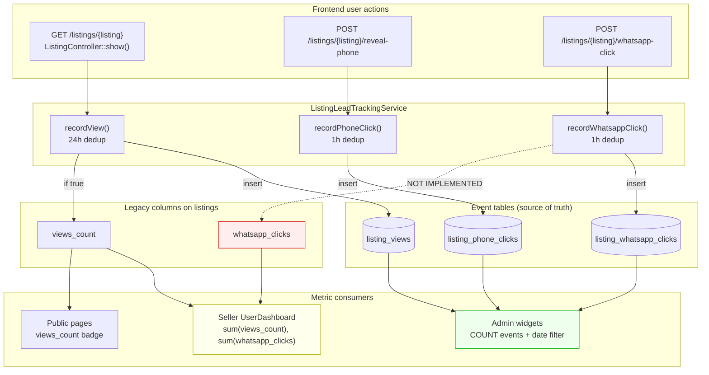

# TD-01 Audit — Seller/Admin Analytics Alignment

**Project:** Nilex Marketplace  
**Date:** 2026-06-12  
**Debt ID:** TD-01  
**Scope:** Read-only audit — seller dashboard vs admin lead-funnel BI  
**Mode:** No code, migrations, or business-logic changes were made

---

## Executive Summary

Nilex operates a **dual-analytics architecture** for listing engagement metrics. Admin BI (Phases 2A–3C) reads **event tables** (`listing_views`, `listing_phone_clicks`, `listing_whatsapp_clicks`) with deduplication and date-range filters. The **seller dashboard** (`UserDashboard` Livewire) reads **legacy counter columns** on the `listings` table (`views_count`, `whatsapp_clicks`).

**Key findings:**

| Metric | Legacy column | Event table | Sync status |
|--------|---------------|-------------|-------------|
| Views | `listings.views_count` | `listing_views` | **Partially synced** (gated increment since view-tracking fix) |
| Phone clicks | *No column* | `listing_phone_clicks` | N/A — seller UI does not expose phone metrics |
| WhatsApp clicks | `listings.whatsapp_clicks` | `listing_whatsapp_clicks` | **Not synced** — column never incremented by `trackWhatsappClick()` |

**Impact:** Sellers see **zero or stale WhatsApp click counts** while admin BI reports real event-table totals. Views are aligned for **new traffic** post-fix but may diverge on **historical data** inflated before the view-tracking fix. Admin widgets apply **date-range filters**; seller stats are **lifetime totals** — numbers are not comparable even when sources align.

**Verdict:** **FAIL** — confirmed dual-source divergence; seller-facing analytics are not aligned with admin source of truth.

**Recommended safest additive path:** Hybrid **Option A + incremental dual-write** — add a `SellerListingAnalyticsService` that reads event tables, extend `trackWhatsappClick()` to mirror the views dual-write pattern, and surface event-based stats on the seller dashboard **without removing** legacy column reads until a one-time backfill is approved.

---

## Root Cause

Phase 2B introduced event-sourced lead tracking (`ListingLeadTrackingService` + event tables) and wired admin widgets (Phases 3A–3C) to read those tables. Phase 2B **did not complete the seller-facing migration**:

1. **Views** — `ListingController::show()` was fixed to gate `views_count` behind `recordView()` return value (`view_tracking_fix_report.md`). New views stay in sync; pre-fix inflation may remain in legacy columns.

2. **WhatsApp** — `trackWhatsappClick()` writes only to `listing_whatsapp_clicks`. The legacy `whatsapp_clicks` column is **never incremented**, leaving seller dashboard sums permanently at 0 (or seed/test values).

3. **Phone** — `revealPhone()` writes to `listing_phone_clicks` only. No legacy column exists; seller dashboard has **no phone metric** at all, while admin funnel treats phone as a first-class funnel step.

4. **Semantic mismatch** — Seller dashboard labels the `clicks` stat as "واتساب" (WhatsApp) and sums `whatsapp_clicks`. Admin BI separates phone and WhatsApp, computes CTR, and filters by today / 7d / 30d. These are different products, not just different data sources.

---

## Affected Files

### 1. Legacy counters (`views_count`, `whatsapp_clicks`, `phone_clicks`)

> **Note:** `phone_clicks` does **not** exist as a column on `listings`. References to `phone_clicks_count` in admin widgets are **SQL aliases** from event-table aggregation, not legacy columns.

| File | Metric(s) | Role |
|------|-----------|------|
| `database/migrations/2026_04_10_110517_create_listings_table.php` | `views_count`, `whatsapp_clicks` | Schema definition |
| `database/migrations/2026_05_12_033525_add_analytics_to_listings_table.php` | `views_count`, `whatsapp_clicks` | Idempotent re-add guard |
| `app/Http/Controllers/ListingController.php` | `views_count` | Increments when `recordView()` returns `true` |
| `app/Livewire/Frontend/UserDashboard.php` | `views_count`, `whatsapp_clicks` | `sum()` for dashboard stats |
| `resources/views/livewire/frontend/user-dashboard.blade.php` | `views_count`, `whatsapp_clicks` | Per-listing display + Chart.js data |
| `resources/views/frontend/listings/show.blade.php` | `views_count` | Public listing detail |
| `resources/views/frontend/home.blade.php` | `views_count` | Listing cards |
| `resources/views/frontend/search-results.blade.php` | `views_count` | Search result cards |
| `tests/Feature/Dashboard/UserDashboardStatsTest.php` | `views_count`, `whatsapp_clicks` | Asserts legacy sums |
| `tests/Feature/Listings/ListingWorkflowTest.php` | `whatsapp_clicks` | Asserts column stays 0 on phone reveal |

**Separate entity (not listing lead analytics):**

| File | Metric | Role |
|------|--------|------|
| `database/migrations/2026_04_24_154433_add_views_count_to_categories_table.php` | `categories.views_count` | Category page visits |
| `app/Http/Controllers/Frontend/CategoryController.php` | `categories.views_count` | Increments on category page load |
| `app/Filament/Admin/Resources/Categories/Tables/CategoriesTable.php` | `categories.views_count` | Admin category table display |
| `app/Models/Category.php` | `views_count` | Model cast |

### 2. Event tables (`listing_views`, `listing_phone_clicks`, `listing_whatsapp_clicks`)

| File | Event table(s) | Role |
|------|----------------|------|
| `database/migrations/2026_06_11_000001_create_listing_lead_tracking_tables.php` | All three | Schema |
| `database/migrations/2026_06_11_000002_add_lead_funnel_analytics_indexes.php` | All three | `created_at` indexes |
| `app/Models/ListingView.php` | `listing_views` | Eloquent model |
| `app/Models/ListingPhoneClick.php` | `listing_phone_clicks` | Eloquent model |
| `app/Models/ListingWhatsappClick.php` | `listing_whatsapp_clicks` | Eloquent model |
| `app/Models/Listing.php` | All three | `views()`, `phoneClicks()`, `whatsappClicks()` relationships |
| `app/Models/User.php` | All three | `listingViews()`, `listingPhoneClicks()`, `listingWhatsappClicks()` |
| `app/Services/ListingLeadTrackingService.php` | All three | Deduped writes (24h views, 1h clicks) |
| `app/Http/Controllers/ListingController.php` | All three | `recordView()`, `recordPhoneClick()`, `recordWhatsappClick()` |
| `app/Filament/Admin/Widgets/LeadFunnelWidget.php` | All three + `offers` | Platform-wide funnel stats |
| `app/Filament/Admin/Widgets/TopListingsWidget.php` | All three + `offers` | Per-listing aggregation (date-filtered) |
| `app/Filament/Admin/Widgets/CategoryPerformanceWidget.php` | All three + `offers` | Per-category aggregation (date-filtered) |
| `scripts/verify_category_performance_widget.php` | All three | Verification against widget SQL |
| `scripts/verify_td04_migration.php` | All three | Index verification |
| `scripts/verify_td04_sqlite.php` | All three | SQLite index verification |
| `tests/Feature/Listings/ListingWorkflowTest.php` | `listing_phone_clicks` | Phone click event assertions |
| `routes/web.php` | — | `POST listings.reveal-phone`, `POST listings.whatsapp-click` |

### 3. Not affected (no lead metrics)

| Area | Files | Notes |
|------|-------|-------|
| Filament Listing resource | `app/Filament/Admin/Resources/Listings/Schemas/ListingTable.php` | No views/clicks columns |
| Revenue widgets | `ConversionMetricsWidget`, `MonetizationOverviewWidget`, etc. | Use `transactions` / `users` |
| Listings chart | `app/Filament/Admin/Widgets/ListingsChart.php` | New listings per day, not engagement |
| REST analytics API | — | **No read API** for seller or admin stats |

---

## Seller Dashboard vs Admin Analytics — Comparison

| Dimension | Seller (`UserDashboard`) | Admin (`LeadFunnelWidget`, `TopListingsWidget`, `CategoryPerformanceWidget`) |
|-----------|--------------------------|-------------------------------------------------------------------------------|
| **Data source** | `listings.views_count`, `listings.whatsapp_clicks` | Event tables + `offers` |
| **Views** | Lifetime `sum(views_count)` per seller | `COUNT(listing_views)` with date filter |
| **Phone clicks** | Not shown | `COUNT(listing_phone_clicks)` with date filter |
| **WhatsApp clicks** | Lifetime `sum(whatsapp_clicks)` — **stale** | `COUNT(listing_whatsapp_clicks)` with date filter |
| **Offers** | Shown in offers workflow, not in stats cards | Included in funnel and ranking |
| **CTR** | None | Phone÷Views, WhatsApp÷Phone, Offers÷WhatsApp |
| **Date filter** | None (lifetime) | Today / 7d / 30d |
| **Deduplication** | Inherited only if legacy column synced | 24h view / 1h click dedup in service |
| **Per-listing breakdown** | Legacy columns on paginated listings | Event subqueries in widget SQL |
| **Chart** | Last 7 **listings** (by pagination order), not last 7 **days** | Widget-specific date windows |

### Code references

**Seller stats (legacy):**

```88:96:app/Livewire/Frontend/UserDashboard.php
        $stats = [
            'total'    => Listing::where('user_id', $user->id)->count(),
            'active'   => Listing::where('user_id', $user->id)->where('status', Listing::STATUS_PUBLISHED)->count(),
            'pending'  => Listing::where('user_id', $user->id)->where('status', Listing::STATUS_PENDING)->count(),
            'rejected' => Listing::where('user_id', $user->id)->where('status', Listing::STATUS_REJECTED)->count(),
            'views'    => Listing::where('user_id', $user->id)->sum('views_count'),
            'clicks'   => Listing::where('user_id', $user->id)->sum('whatsapp_clicks'),
        ];
```

**Admin funnel (event tables):**

```73:87:app/Filament/Admin/Widgets/LeadFunnelWidget.php
        $totalViews = (int) ListingView::query()
            ->where('created_at', '>=', $startDate)
            ->count();

        $totalPhoneClicks = (int) ListingPhoneClick::query()
            ->where('created_at', '>=', $startDate)
            ->count();

        $totalWhatsappClicks = (int) ListingWhatsappClick::query()
            ->where('created_at', '>=', $startDate)
            ->count();

        $totalOffers = (int) Offer::query()
            ->where('created_at', '>=', $startDate)
            ->count();
```

**Views dual-write (partial sync):**

```18:22:app/Http/Controllers/ListingController.php
        if ($leadTracking->recordView($listing, auth()->user(), $request->ip())) {
            $listing->increment('views_count');
        }
```

**WhatsApp — event only, no legacy sync:**

```58:62:app/Http/Controllers/ListingController.php
    public function trackWhatsappClick(Listing $listing, ListingLeadTrackingService $leadTracking): JsonResponse
    {
        $leadTracking->recordWhatsappClick($listing, auth()->user());

        return response()->json(['success' => true]);
    }
```

---

## Current Source of Truth

| Consumer | Authoritative source | Rationale |
|----------|---------------------|-----------|
| Admin lead-funnel BI | **Event tables** | Designed for dedup, audit trail, date-range SQL; verified by phase scripts |
| `ListingLeadTrackingService` | **Event tables** | Single write path for all tracking actions |
| Seller dashboard stats | **Legacy columns** (de facto) | UI reads `views_count` / `whatsapp_clicks` directly |
| Public listing pages (views badge) | **Legacy `views_count`** | Displayed on show/home/search; synced on new views |
| Category admin table | **`categories.views_count`** | Unrelated — category page visits, not listing leads |
| Tests (`UserDashboardStatsTest`) | **Legacy columns** | Factory sets column values; no event rows |

**Architectural intent (post Phase 3):** Event tables are the **intended** source of truth for lead analytics. Legacy columns are a **compatibility layer** that was only partially maintained (views yes, WhatsApp no, phone never existed).

---

## Data Divergence Scenarios

| # | Scenario | Legacy behavior | Event behavior | Divergence |
|---|----------|-----------------|----------------|------------|
| 1 | WhatsApp button clicked | `whatsapp_clicks` unchanged | Row in `listing_whatsapp_clicks` | **Permanent** — seller sees 0 |
| 2 | Phone reveal (auth user) | No column | Row in `listing_phone_clicks` | Seller blind; admin sees clicks |
| 3 | Page refresh within 24h view dedup | No increment (post-fix) | No new row | **Aligned** |
| 4 | Pre-fix view inflation (historical) | Inflated `views_count` | Correct deduped count | **Historical gap** until backfill |
| 5 | Guest WhatsApp click | Legacy unchanged | Event with `user_id = null` | Seller 0; admin counts event |
| 6 | Admin 7d filter vs seller lifetime | Lifetime sum | Last 7 days only | **Not comparable** by design |
| 7 | Seller chart "last 7 listings" | Legacy per listing | N/A | Misleading label vs time-based admin charts |
| 8 | Test/seed manual column values | Arbitrary `views_count` / `whatsapp_clicks` | No matching events | Tests pass; production semantics wrong |
| 9 | Listing deleted | Column deleted with row | Events cascade-delete | Both removed — no orphan divergence |
| 10 | WhatsApp click dedup (1h, auth user) | Would not increment anyway | Second click skipped | Aligned **if** dual-write added |

---

## Impact Assessment

### Seller dashboard — **HIGH**

- WhatsApp stat is **functionally broken** (always 0 in live traffic).
- No phone-click visibility despite being a core funnel step for ops.
- No date-range context; sellers cannot see recent performance.
- Chart uses legacy columns for the wrong dimension (last N listings, not time).
- Trust risk when sellers compare their numbers to support/admin screenshots.

### Admin dashboard — **LOW**

- Widgets consistently use event tables with verified SQL.
- Date filters work as designed.
- No dependency on legacy listing columns for lead BI.

### Reports — **NONE (negative)**

- Phase reports (`phase_3b_*`, `phase_3c_*`, `view_tracking_fix_report.md`) document event-table correctness.
- Verification scripts (`verify_category_performance_widget.php`) validate event aggregation, not seller UI.

### Widgets — **LOW (admin) / N/A (seller)**

- Admin: `LeadFunnelWidget`, `TopListingsWidget`, `CategoryPerformanceWidget` — correct.
- Seller: no Filament widgets; Livewire dashboard only.

### APIs — **LOW**

- Write-only tracking endpoints: `POST /listings/{listing}/reveal-phone`, `POST /listings/{listing}/whatsapp-click`.
- No JSON endpoint exposes seller or listing analytics for mobile/third-party clients.

---

## Data Flow Diagram



---

## Risk Assessment

| Risk | Likelihood | Severity | Mitigation in additive fix |
|------|------------|----------|----------------------------|
| Seller sees 0 WhatsApp clicks forever | **Certain** (current) | High | Dual-write + event-based seller stats |
| Support tickets — "admin says X, dashboard says Y" | High | High | Align seller to event tables |
| Historical `views_count` > event count | Medium (pre-fix data) | Medium | Optional one-time backfill script |
| Breaking `UserDashboardStatsTest` on migration | High when changing reads | Medium | Add new tests; keep legacy tests until deprecation approved |
| Performance — seller event aggregation | Low at MVP scale | Medium | Indexed `listing_id` + `created_at`; cache per user |
| Removing legacy column reads | N/A if additive | High | **Do not remove** without approval |
| Guest WhatsApp inflation (no auth) | Medium | Low–Medium | Document; optional rate limit (separate TD) |

---

## Proposed Fix Options

### Option A — Compatibility layer (recommended base)

**Description:** Keep legacy columns and event tables. Add a `SellerListingAnalyticsService` that **reads event tables** for seller-facing stats. Optionally dual-write legacy columns on successful event inserts (mirror views pattern).

| Pros | Cons |
|------|------|
| 100% backward compatible | Two sources until backfill completes |
| No schema deletion | Slightly more code to maintain |
| Incremental rollout possible | Must document which source UI uses |
| Matches existing views dual-write pattern | Historical gap needs one-time script |

**Additive changes only:**

1. New `app/Services/SellerListingAnalyticsService.php`
2. Extend `trackWhatsappClick()` to increment `whatsapp_clicks` when `recordWhatsappClick()` returns `true`
3. Extend `UserDashboard` to call service for stats (keep legacy sums as fallback or parallel)
4. Optional `scripts/backfill_listing_legacy_counters.php` (approval-gated)
5. Add feature tests against event tables

### Option B — Seller dashboard reads event tables directly

**Description:** Replace stat computation in `UserDashboard` with SQL aggregates on event tables scoped to `user_id` listings. Blade per-listing rows use `withCount()` on relationships or service helpers.

| Pros | Cons |
|------|------|
| Immediate alignment with admin BI | Changes seller numbers abruptly if legacy was wrong |
| Single read path for seller | Existing tests assert legacy columns — must extend, not replace |
| Enables date filters later | Public pages still use `views_count` — partial alignment |

**Risk:** Changing `sum(whatsapp_clicks)` to event counts **replaces displayed behavior** without dual-write/backfill. Safer as **additive display** (new stat keys) first.

### Option C — Sync strategy (batch + ongoing)

**Description:** Scheduled job or artisan command periodically sets `views_count` / `whatsapp_clicks` from `COUNT(*)` on event tables. Ongoing dual-write on every track action.

| Pros | Cons |
|------|------|
| Legacy columns stay usable for public badges | Batch job can be expensive at scale |
| External integrations could keep reading columns | Job lag creates temporary divergence |
| Backfills historical gap | Requires operational monitoring |

**Best combined with Option A** for historical repair, not as sole strategy.

---

## Backward Compatibility Analysis

| Change | Breaks existing behavior? | Notes |
|--------|---------------------------|-------|
| Add `SellerListingAnalyticsService` | No | New file |
| Dual-write `whatsapp_clicks` | No | Column starts updating; was 0 before |
| Seller dashboard reads events | **Maybe** | Numbers will increase from 0 — intended correction |
| Remove `sum(whatsapp_clicks)` | **Yes** | **NOT ALLOWED** without approval |
| Drop legacy columns | **Yes** | **NOT ALLOWED** |
| Change admin widgets | **Yes** | Out of scope — already correct |
| Add phone stat to seller UI | No | Additive UI element |
| Add date filter to seller UI | No | Additive |
| Update `UserDashboardStatsTest` only | **Maybe** | Tests encode legacy contract; extend with event-based tests |
| Public `views_count` display | No if dual-write maintained | |

**Constraint compliance:** All three options can be implemented additively if legacy reads are **retained** (even as fallback) and no menus, widgets, routes, or resources are removed.

---

## Recommended Approach

**Safest additive fix (phased, approval-gated):**

### Phase 1 — Stop the bleed (minimal, mirrors views fix)

1. In `ListingController::trackWhatsappClick()`, gate `$listing->increment('whatsapp_clicks')` behind `recordWhatsappClick()` returning `true` — identical pattern to views.
2. Add Pest test: WhatsApp click creates event **and** increments legacy column; deduped click does neither.

### Phase 2 — Seller reads aligned data (additive service)

1. Add `SellerListingAnalyticsService` with methods:
   - `totalViewsForUser(User $user): int` — `listing_views` joined to seller listings
   - `totalPhoneClicksForUser(User $user): int`
   - `totalWhatsappClicksForUser(User $user): int`
   - `perListingStats(Listing $listing): array` — for table rows and chart
2. Extend `UserDashboard::$stats` with **additional keys** (e.g. `views_events`, `phone_clicks`, `whatsapp_clicks_events`) or switch display to event-based values while **keeping** legacy keys in the array for backward compatibility.
3. Add optional phone stat card to seller dashboard (additive UI).

### Phase 3 — Historical repair (optional, separate approval)

1. One-time `scripts/backfill_listing_legacy_counters.php` to set `views_count` / `whatsapp_clicks` from event `COUNT(*)` per listing.
2. Document expected delta for listings with pre-fix view inflation.

### Explicitly deferred (document only)

- Removing legacy column reads from `UserDashboard`
- Dropping `views_count` / `whatsapp_clicks` columns
- Changing admin widgets (already correct)
- Replacing public listing view badges with live event counts

---

## PASS / FAIL Verdict

| Criterion | Result |
|-----------|--------|
| Dual analytics sources confirmed | **YES** |
| WhatsApp legacy column unsynced | **YES** — TD-02 related |
| Seller/admin metric mismatch | **YES** |
| Views partially synced post-fix | **YES** |
| Additive fix path identified | **YES** |
| Safe to implement without deletions | **YES** |

### **VERDICT: FAIL**

Seller-facing analytics are **not aligned** with admin event-table BI. The gap is **confirmed and production-visible** (WhatsApp clicks). Implementation must wait for explicit approval per protection rules.

---

## Approval Gate

This document is **audit-only**. No implementation was performed.

**Awaiting approval** before TD-01 implementation. Recommended first approved slice:

1. Phase 1 — WhatsApp dual-write in `ListingController::trackWhatsappClick()`
2. Phase 2 — `SellerListingAnalyticsService` + additive seller dashboard stats

**Stop here. Do not implement until approved.**

---

*End of TD-01 Seller/Admin Analytics Alignment Audit*
