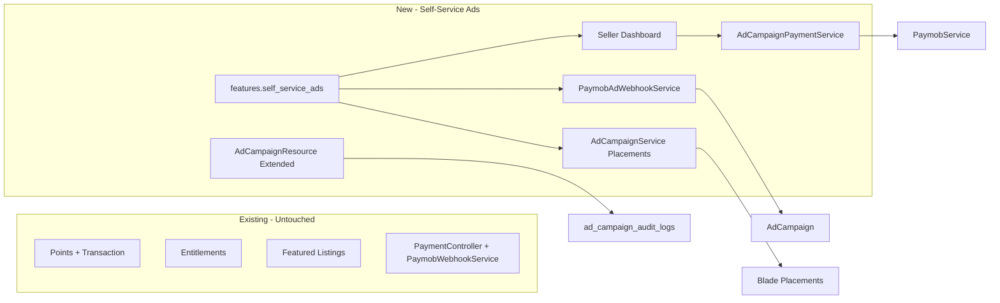

# Self-Service Advertising Platform — Architecture & Implementation Plan

**Date:** 2026-06-13  
**Project:** Nilex Marketplace  
**Stack:** Laravel 13 · Filament v5.4 · Paymob · Alpine.js · Livewire  
**Status:** Complete (Implemented 2026-06-13)

---

## Architecture Overview

The Self-Service Advertising Platform allows **sellers** to purchase ad placements via **Paymob**, while the existing **admin-managed campaigns**, **Points**, **Entitlements**, **Featured Listings**, and **checkout** remain fully isolated.



---

## Existing Components Detected

| Layer | Component | Status |
|-------|-----------|--------|
| Model | `AdCampaign`, `AdCampaignLog` | ✅ Exists |
| Migration | `2026_06_13_000001`, `2026_06_13_000002` | ✅ Exists (verify deployed) |
| Service | `AdCampaignService` | ✅ Exists |
| Observer | `AdCampaignObserver` | ✅ Exists |
| Job | `TrackAdImpressionJob` | ✅ Exists |
| Command | `ExpireCampaigns` | ✅ Exists |
| Filament | `AdCampaignResource`, `AdCampaignStats` | ✅ Exists |
| Frontend | `hero_top`, `home_feed`, `category_page` | ✅ Wired |
| Tracking | `AdTrackingController`, dedup 60 min | ✅ Exists |
| Paymob wrapper | `PaymobService` | ✅ Exists (reuse) |
| Points webhook | `PaymobWebhookService` | ✅ Exists (do not modify) |

---

## Components Reused

- `AdCampaign` model — extend with payment/seller columns
- `AdCampaignService` — extend display rules, seller methods, cache
- `AdCampaignResource` — extend table/form/actions
- `PaymobService` — HTTP wrapper for auth/order/payment key
- `ad-banner.blade.php` — all placement rendering
- `TrackAdImpressionJob` — impression pipeline
- Livewire pattern from `UserDashboard` / `SellerLeads`

---

## Components Extended

| File | Changes |
|------|---------|
| `app/Models/AdCampaign.php` | Payment fields, `seller()`, display scopes |
| `app/Services/AdCampaignService.php` | Paid+approved gate, pricing, seller CRUD |
| `AdCampaignResource` + `ListAdCampaigns` | Approve/Reject, payment columns |
| `AdCampaignObserver` | `login_page` cache key |
| `resources/views/auth/login.blade.php` | Login banner placement |
| `bootstrap/app.php` | CSRF except for ads webhook, middleware alias |
| `routes/web.php` or `routes/ads.php` | Route registration hook |

---

## Components Created

### Config
```
config/features.php          → self_service_ads: false
config/ad_pricing.php        → placements × durations (7,15,30,60 days)
```

### Database
```
2026_06_13_100001_add_self_service_fields_to_ad_campaigns_table.php
2026_06_13_100002_create_payment_attempts_table.php
2026_06_13_100003_create_ad_campaign_audit_logs_table.php
```

### Application
```
app/Models/PaymentAttempt.php
app/Models/AdCampaignAuditLog.php
app/Services/AdCampaignPaymentService.php
app/Services/PaymobAdWebhookService.php
app/Http/Controllers/PaymobWebhookController.php
app/Http/Middleware/EnsureSelfServiceAdsEnabled.php
app/Policies/AdCampaignPolicy.php
app/Jobs/TrackAdClickJob.php
app/Jobs/InvalidateAdCampaignCacheJob.php
app/Notifications/AdCampaignApprovedNotification.php
app/Notifications/AdCampaignRejectedNotification.php
app/Notifications/AdCampaignPaymentReceivedNotification.php
app/Livewire/Frontend/SellerAdCampaigns.php
app/Livewire/Frontend/SellerAdCampaignCreate.php
app/Livewire/Frontend/SellerAdCampaignShow.php
routes/ads.php
```

---

## Database Changes

### Extend `ad_campaigns` (new migration only)

| Column | Type | Purpose |
|--------|------|---------|
| `seller_id` | FK users nullable | Self-service owner |
| `payment_status` | enum pending/paid/failed/refunded | Payment gate |
| `paymob_order_id` | string nullable | Paymob order reference |
| `paymob_transaction_id` | string nullable | Idempotency key |
| `amount_paid` | decimal nullable | Verified amount |
| `paid_at` | timestamp nullable | Payment timestamp |
| `placement` | enum + `login_page` | Login page banner |

**Preserve:** all existing columns — never rename or remove.

### `payment_attempts`

| Column | Notes |
|--------|-------|
| `campaign_id` | FK ad_campaigns |
| `amount` | Expected charge |
| `paymob_order_id` | Paymob order |
| `paymob_transaction_id` | Unique index for idempotency |
| `status` | pending/success/failed |
| `payload` | JSON webhook payload |

### `ad_campaign_audit_logs`

| Column | Notes |
|--------|-------|
| `campaign_id` | FK ad_campaigns |
| `admin_id` | FK users |
| `action` | approve/reject/update/etc. |
| `old_values` | JSON |
| `new_values` | JSON |

**Note:** `ad_campaign_logs` remains for impression/click tracking — separate from admin audit.

---

## Routes

### Seller Dashboard (auth + otp.verified + feature flag)

| Method | URI | Name |
|--------|-----|------|
| GET | `/dashboard/ads` | `dashboard.ads.index` |
| GET | `/dashboard/ads/create` | `dashboard.ads.create` |
| POST | `/dashboard/ads` | `dashboard.ads.store` |
| GET | `/dashboard/ads/{campaign}` | `dashboard.ads.show` |
| POST | `/dashboard/ads/{campaign}/pay` | `dashboard.ads.pay` |

### Webhook (no auth, CSRF exempt)

| Method | URI | Handler |
|--------|-----|---------|
| POST | `/webhooks/paymob/ads` | `PaymobWebhookController@ads` |

### Existing (gate when self-service enabled)

| Route | Notes |
|-------|-------|
| `ads.impression` | Keep; validate campaign displayable |
| `ads.click` | Keep; queue click job |
| `ads.pricing` | Link to self-service when flag ON |

**Preferred:** dedicated `routes/ads.php` loaded from `bootstrap/app.php`.

---

## Controllers & Services

| Class | Responsibility |
|-------|----------------|
| `AdCampaignPaymentService` | Price from config, create attempt, initiate Paymob checkout |
| `PaymobAdWebhookService` | HMAC verify, amount match, idempotency, mark paid, set dates |
| `PaymobWebhookController` | Thin HTTP layer for ads webhook only |
| `AdCampaignService` | Single entry for placement retrieval, tracking, cache |

---

## Filament Admin (`AdCampaignResource`)

### Table columns (add/extend)
- Title, Placement, **Seller**, **Payment Status**, **Approval Status**
- Views, Clicks, Starts/Ends dates

### Actions
- **Approve** — sets `approval_status = approved`, audit log, cache clear, notification
- **Reject** — modal with reason → `rejected_reason`, audit log, notification

### Authorization
- Filament Shield permissions (generate after resource stable)
- `AdCampaignPolicy` for model-level checks

---

## Security Review

| Control | Implementation |
|---------|----------------|
| HMAC validation | Reuse Paymob field order from existing service (mirror, don't modify points service) |
| Transaction success | Reject pending/failed callbacks |
| Amount verification | Compare `amount_cents` vs `payment_attempts.amount` |
| Campaign ownership | Webhook resolves campaign via merchant order ID namespace |
| Replay / duplicate | Unique `paymob_transaction_id` + row lock + `is_processed` on attempt |
| Rejected webhooks | Log all rejections with IP + reason |
| Feature flag OFF | Webhook returns 404/disabled; seller routes blocked |
| CSRF | Exempt only `/webhooks/paymob/ads` in `bootstrap/app.php` |

---

## Paymob Flow

```
1. Seller submits campaign draft → AdCampaign (payment_status=pending, approval_status=pending)
2. AdCampaignPaymentService calculates price from config/ad_pricing.php
3. Creates payment_attempts row
4. PaymobService.createOrder(merchantOrderId: "nilex-ad:{campaign_id}:{attempt_id}")
5. Redirect seller to Paymob iframe/checkout
6. Paymob POST /webhooks/paymob/ads
7. PaymobAdWebhookService:
   - Verify HMAC
   - Lock payment_attempt + campaign rows
   - If transaction_id already processed → 200 already_processed
   - Validate amount + success state
   - Update payment_status=paid, amount_paid, paid_at
   - Set starts_at/ends_at from duration
   - Notify seller (queued)
8. Admin approves in Filament → campaign becomes displayable
```

**Display rule (never before manual approval):**
```
payment_status = paid
AND approval_status = approved
AND starts_at <= now()
AND ends_at >= now()
AND deleted_at IS NULL
```

**Admin legacy campaigns:** `payment_status IS NULL` treated as pre-paid (backward compatible).

---

## Cache Strategy

| Key pattern | TTL | Invalidation |
|-------------|-----|--------------|
| `ad_campaign_{placement}` | 300s | Observer + `InvalidateAdCampaignCacheJob` |
| `ad_campaign_category_page_{id}` | 300s | Same |
| `ad_campaign_login_page` | 300s | New key for login placement |

- Eager load `media` in `getForPlacement()` — already done
- Max 1 query per placement retrieval cycle
- Never query campaigns directly in Blade

---

## Tracking Strategy

| Event | Dedup | Processing |
|-------|-------|------------|
| Impression | IP + UA, 60 min cache | `TrackAdImpressionJob` (existing) |
| Click | IP + UA, 60 min cache | `TrackAdClickJob` (new — queued) |

---

## Frontend Placements

| Placement | View | Status |
|-----------|------|--------|
| Hero Top Banner | `frontend/home.blade.php` | ✅ Exists |
| Home Feed Banner | `frontend/home.blade.php` | ✅ Exists |
| Category Page Banner | `frontend/category.blade.php` | ✅ Exists |
| Login Page Banner | `auth/login.blade.php` | 🔲 To wire |

All via `<x-ad-banner :campaign="$campaign" />` + `AdCampaignService::getForPlacement()`.

---

## Files Created (Planned)

See **Components Created** section above (~25–30 new files).

## Files Modified (Planned)

```
app/Models/AdCampaign.php
app/Services/AdCampaignService.php
app/Filament/Admin/Resources/AdCampaigns/AdCampaignResource.php
app/Filament/Admin/Resources/AdCampaigns/Pages/ListAdCampaigns.php
app/Observers/AdCampaignObserver.php
resources/views/auth/login.blade.php
resources/views/frontend/ads/pricing.blade.php
bootstrap/app.php
routes/web.php (minimal require)
.env.example
```

## Files Intentionally NOT Modified

```
app/Services/PaymobWebhookService.php
app/Services/PaymobService.php (wrap, don't edit credentials logic)
app/Http/Controllers/Frontend/PaymentController.php
app/Services/PointService.php
app/Services/EntitlementService.php
app/Models/PointPlan.php
app/Models/Transaction.php
Featured listing / promotion logic
```

---

## Manual Testing Checklist

### Feature Flag
- [ ] `self_service_ads = false` → seller routes 404/disabled, webhook disabled
- [ ] `self_service_ads = true` → seller dashboard accessible

### Seller Flow
- [ ] Create draft campaign with all fields (RTL, Arabic validation)
- [ ] Alpine price calculator matches `config/ad_pricing.php`
- [ ] Image upload max 2MB, WebP conversions applied
- [ ] Paymob checkout redirect works
- [ ] Retry payment on failed attempt

### Webhook
- [ ] Valid HMAC → marks paid
- [ ] Invalid HMAC → 400 + logged
- [ ] Duplicate transaction_id → idempotent 200
- [ ] Amount mismatch → 400 + logged
- [ ] Points webhook `/payments/callback` still works unchanged

### Admin
- [ ] Approve/Reject with reason modal
- [ ] Audit log row created in `ad_campaign_audit_logs`
- [ ] Seller notification sent (queued)

### Display
- [ ] Unpaid campaign never shows
- [ ] Paid but pending approval never shows
- [ ] Paid + approved + in date range shows on all 4 placements
- [ ] Expired / soft-deleted never shows

### Tracking
- [ ] Impression dedup within 60 min
- [ ] Click dedup within 60 min
- [ ] Jobs processed on queue worker

### Isolation
- [ ] Points purchase still credits points
- [ ] Featured listing with points unchanged
- [ ] Entitlements unchanged

---

**Implementation status:** Complete. Phase reports: `self_service_execution_phase1.md` through `phase6.md`. Enable with `SELF_SERVICE_ADS=true` in `.env`.
